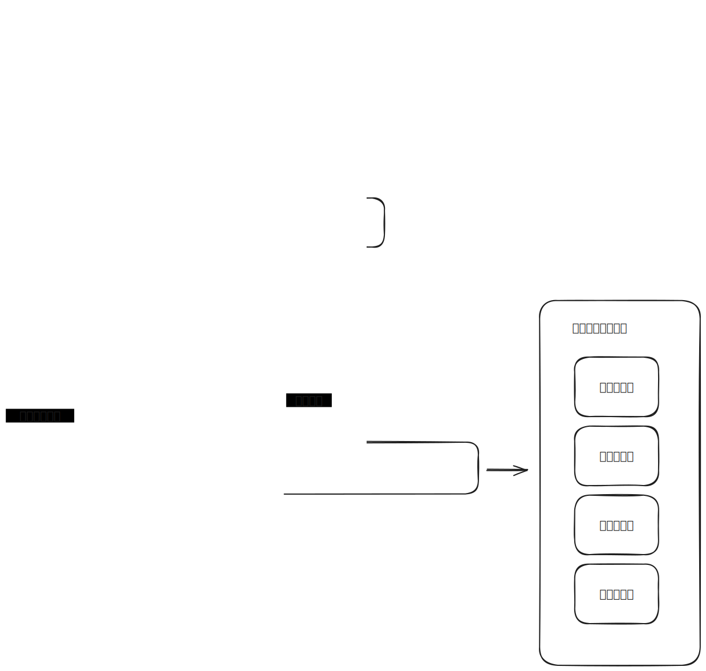
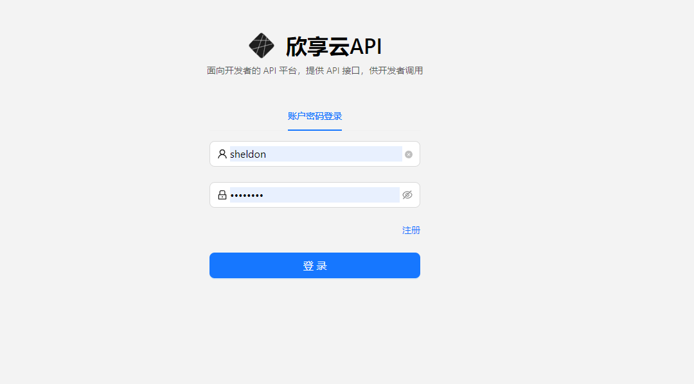
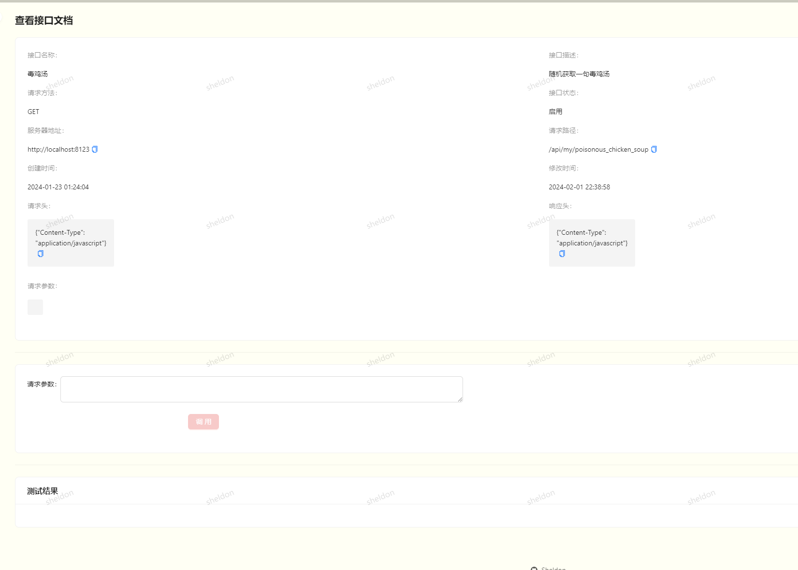
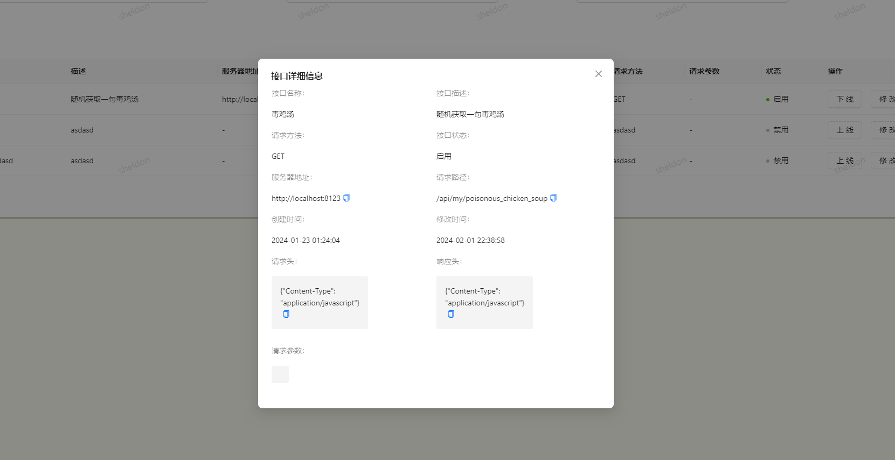

<!-- PROJECT LOGO -->

<div align="center">
    
    <h3 align="center">欣享云API</h3>
    <p align="center">
        基于 Spring Boot + Dubbo + React 的全栈微服务项目。
        <br />
        本项目是一个面向开发者的 API 平台，提供 API 接口供开发者调用。
    </p>
</div>
<!-- TABLE OF CONTENTS -->

<details>
  <summary>Table of Contents</summary>
  <ol>
    <li>
      <a href="#关于项目">关于项目</a>
      <ul>
        <li><a href="#项目架构图">项目架构图</a></li>
        <li><a href="#技术栈">技术栈</a></li>
      </ul>
    </li>
    <li>
      <a href="#用法">用法</a>
      <ul>
        <li><a href="#演示视频">演示视频</a></li>
        <li><a href="#项目截图">项目截图</a></li>
      </ul>
    </li>
    <li><a href="#快速开始">快速开始</a>
      <ul>
        <li><a href="#先决条件">先决条件</a></li>
        <li><a href="#安装">安装</a></li>
      </ul>
      </li>
    <li><a href="#联系方式">联系方式</a></li>
  </ol>
</details>

## 关于项目

### 项目架构图

<div align="center">
    
</div>
<div>
    <p>
        该项目共有五个模块：
    <ul>
        <li>用户前端模块：供开发者游览所有的接口，查看接口详细信息，并支持在线调用接口</li>
        <li>后台管理模块：管理员可以管理接口等功能，以及查看用户使用接口的情况，例如使用次数、错误调用等</li>
        <li>API网关模块：负责接口的流量控制、计费统计、安全防护等功能，提供一致的接口服务质量，和简化API的管理工作</li>
        <li>客户端SDK模块：提供一个简化的工具包，使得开发者可以更方便的调用接口，例如提供了预封装的HTTP请求方法，接口调用接口等</li>
        <li>模拟接口模块：提供各种模拟接口供开发者使用和测试</li>
    </ul>
    </p>
    <p align="center">
        <a href="https://github.com/sheldon-3601e/api-management">后端模块</a>
        ·
        <a href="https://github.com/sheldon-3601e/api-frontend">前端模块</a>
    </p>

</div>

### 技术栈

#### 前端

- React 18
- Ant Design Pro 5.x 脚手架 
- Ant Design & Procomponents 组件库 
- Umi 4 前端框架 
- OpenAPI 前端代码生成

#### 后端

- Spring Boot
- MySQL 数据库
- MyBatis-Plus 及 MyBatis X 自动生成
- API 签名认证（Http 调用）
- Spring Boot Starter（SDK 开发）
- Dubbo 分布式（RPC、Nacos） 
- Swagger + Knife4j 接口文档生成
- Spring Cloud Gateway 微服务网关 
- Hutool、Apache Common Utils、Gson 等工具库


## 用法

### 演示视频

[演示视频](https://github.com/sheldon-3601e/BI-backend/assets/120535868/78219988-df88-4645-9487-9ef763915e3e
)

### 网站截图







## 快速开始

这是一个示例，说明如何在本地设置项目的说明。若要启动并运行本地副本，请按照以下简单示例步骤操作。

### 先决条件

列出使用该软件所需的内容

- npm@16.20.2
- MySQL@8.1.0
- Redis@3.2.1
- Nacos@2.2.3

### 安装

下面是一个示例，说明如何安装和设置应用。

1. 克隆项目到本地

   ```sh
   git clone https://github.com/your_username_/Project-Name.git
   ```

2. 安装依赖s

   ```sh
   npm install
   ```

3. 在图表分析模块中`application.yml`中，填入星火大模型的参数

   ```yml
   appid: xxx
   apiKey: xxx
   apiSecret: xxx
   ```

4. 启动 Redis 和 RabbitMQ 服务

5. 分别启动各个模块

<p align="right">(<a href="#readme-top">back to top</a>)</p>


<!-- CONTACT -->

## 联系方式

Your Name - Sheldon - email@Sheldon_kkk@126.com

Personal homepage: [https://github.com/sheldon-3601e](https://github.com/sheldon-3601e)

<p align="right">(<a href="#readme-top">back to top</a>)</p>

